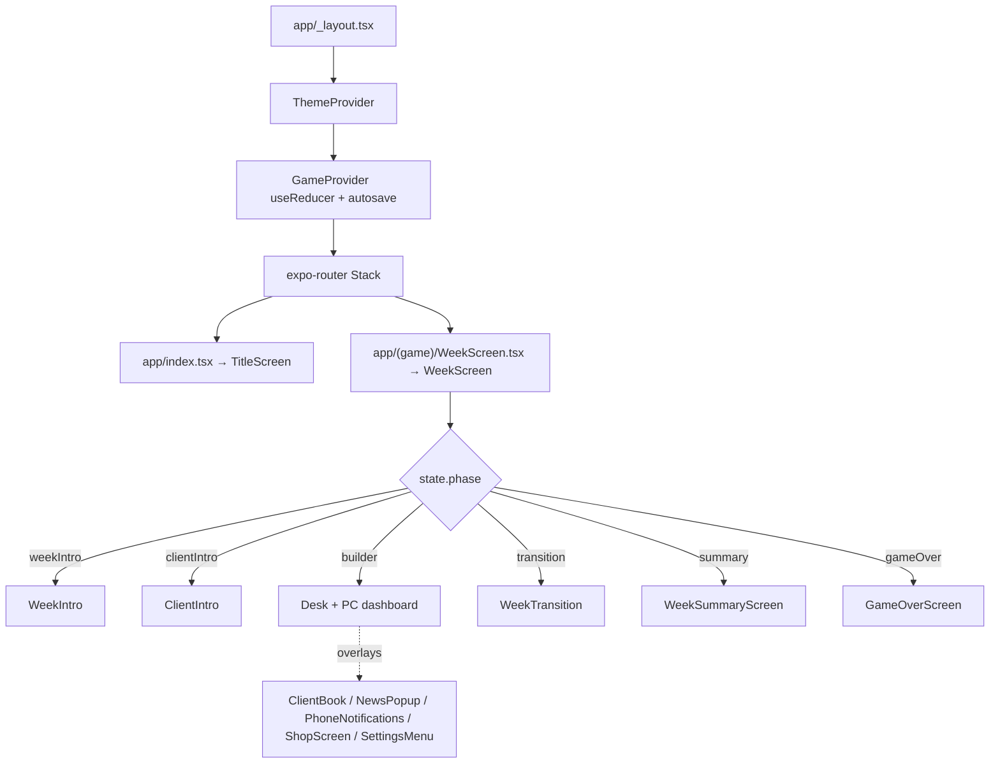
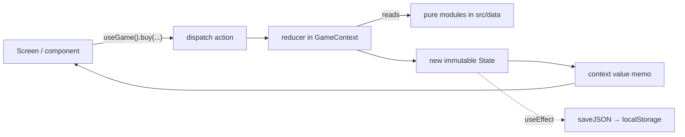
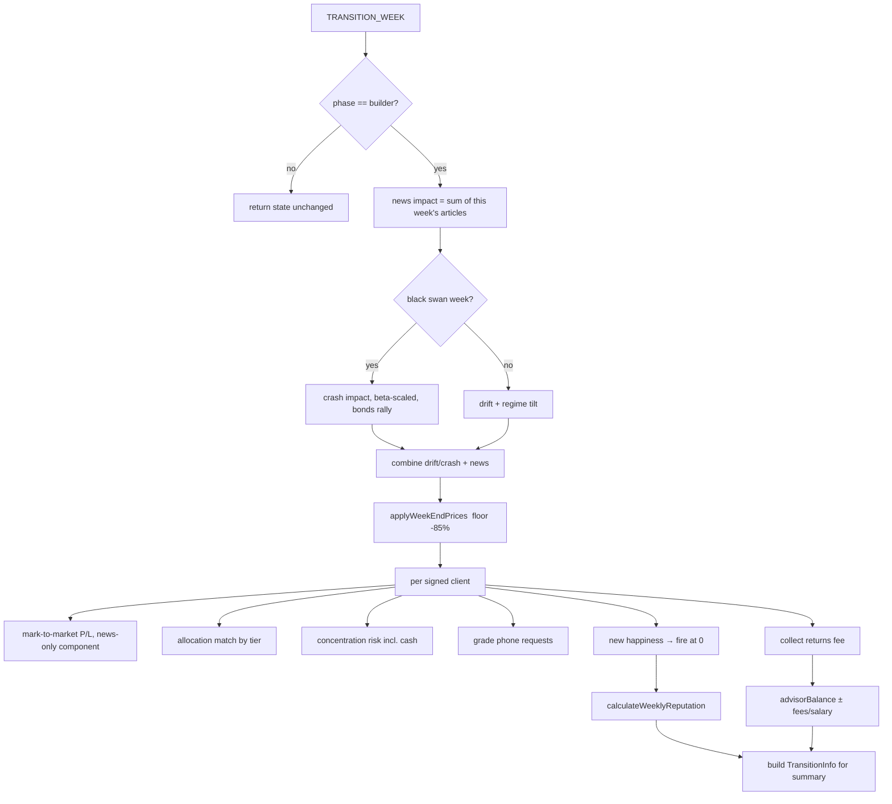
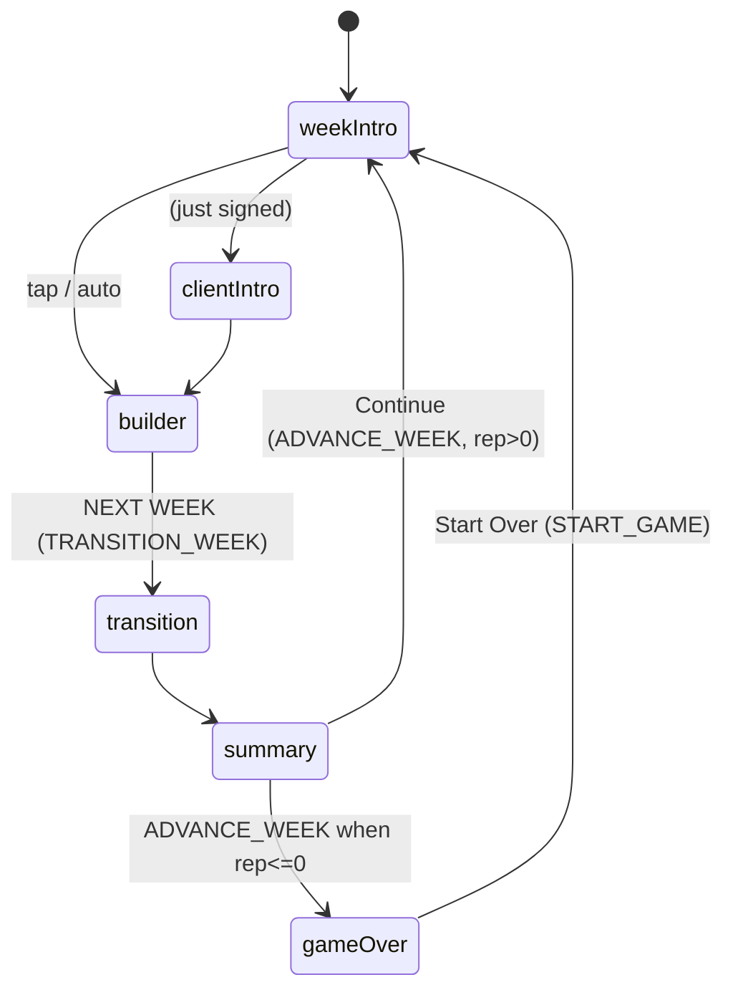

# PROJECT_CONTEXT.md

> Definitive reference for the **Portfolio Puzzle** repository.
> Written for a new AI coding assistant (or human) who has never seen the project.
> After reading this you should be able to contribute without asking basic questions.
>
> **Design companion:** `GAME_DESIGN_AUDIT.md` holds the gameplay/UX audit, the
> onboarding roadmap, and the phased design backlog. Read it before adding mechanics.
>
> **Accuracy note:** the root `README.md` and parts of `app.json` are *stale* — they
> describe an earlier "3-level allocation-puzzle" concept that no longer exists. This
> document reflects the **actual current code** (through commit `6ba3e87`). When the
> README and this file disagree, **this file is correct**.

---

## 1. Executive Summary

**What it is.** Portfolio Puzzle is a single-player, mobile-first **financial-advisor
career simulation** built with React Native + Expo. You run a small advisory firm.
Each in-game week you read prospective clients, sign them to 8-week contracts, build
and rebalance a persistent brokerage portfolio for each one, interpret market news,
and try to grow their money while keeping them happy — all of which feeds your
**advisor reputation**. Run reputation to zero and you're fired (game over).

**Why it exists.** It started (commit `574c734`) as a tiny "match the ideal asset
allocation, score 0–100" puzzle. Over ~35 commits it was repeatedly rebuilt into a
systems-driven **management/tycoon game**: hidden-impact news you must interpret,
persistent stock prices, tiered clients, a reputation career, an advisor economy with
a shop and upgrades, insider trading, economic cycles, and black-swan crashes. The
guiding creative idea: **make the player *think like an investor*** — read ambiguous
signals, manage risk, diversify, and live with consequences that compound over time.

**The vision / end goal.** A polished, replayable **retro pixel-art stock-market
tycoon** that feels like "a real video game, not a dashboard app." The player should
feel the tension of managing multiple demanding clients through boom/bust cycles,
earning fees, and spending them on upgrades that unlock deeper strategy (early news,
more clients, insider access). It is designed to scale into higher client tiers
(e.g. a "political" tier) and additional systems without rewrites.

**Intended users.** Casual-to-midcore mobile players who enjoy management/tycoon and
"numbers go up" games (think *Game Dev Story*, *Kairosoft* titles, idle/strategy
hybrids). Secondarily, anyone curious about investing concepts (diversification,
beta, defensive assets, flight-to-safety) presented through play rather than lecture.

---

## 2. Current State of the Project

The game is **fully playable end-to-end** in a single endless career. There is no
"win" — the goal is survival and growth; the terminal state is being fired.

### Fully implemented & stable

- **Career loop** — title → name your advisor/firm → weekly cycle → game over, with
  autosave/continue.
- **Persistent brokerage accounts** — each client's holdings, cash and cost basis
  carry across the whole contract; only valuation marks to market weekly. (`a269bdb`)
- **Persistent stock prices** — 22 stocks; prices carry week-to-week, never reset.
- **Weekly price engine** — natural drift + economic-regime tilt + cumulative news
  impact, all resolved at week-end, floored at −85% so prices can't go negative.
- **Tiered news** — ~36 authored headlines cycle every week, each rolled to a
  minor/moderate/major impact band, so effect genuinely varies. (`6ba15b3`)
- **Reputation system** — starts 22; driven by returns, client-happiness milestones,
  and firings; clamps 0–100; unlocks clients at rep 20/27/34/40.
- **Tier-aware happiness / allocation / concentration** — four client tiers with
  escalating capital, tighter allocation tolerance, harsher penalties.
- **Advisor economy + shop** — signing fees + a cut of positive weekly returns fund a
  balance you spend in a shop with a FINANCES ledger. (`6ba15b3`)
- **Three upgrades** — Assistant (+1 client slot), News Terminal (preview next week +
  exclusive scoops), Political Funding (Politician Bill insider tips).
- **Economic cycles** — Expansion / Steady / Downturn regimes rotate every 3–8 weeks
  and tilt returns by beta.
- **Black-swan crashes** — every 15–20 weeks; beta-scaled crash, bonds rally.
- **Phone messages** — clients text buy/add requests graded at week-end (±happiness).
- **Contract report cards** — finished contracts are graded S–D, pay a tier×grade
  completion bonus and small rep, shown atop the week summary.
- **Roster revival** — fired clients reconsider after 8 weeks, dismissed after 4
  (removes the shrinking-roster soft-lock).
- **Happiness legibility** — per-factor breakdown stored per client and surfaced in
  WeekTransition / ClientDetail; portfolio mix bar (stocks/bonds/cash) in the builder;
  a next-goal ticker on the dashboard.
- **Full theming** — light + dark palettes; every screen and shared component is
  theme-reactive; the toggle persists. (`6ba3e87`)
- **Save system** — full-state autosave to web `localStorage` (in-memory fallback).

### Partially implemented / stubbed

- **Political client tier** — Political Funding *mentions* unlocking political clients
  and the insider-trading plumbing exists, but the political client cards themselves
  are **not built yet** (deliberately deferred; see `advisorEconomy.ts` comments).
- **Shop pricing/balance** — upgrade costs ($800 / $1,500 / $6,000) and fee
  percentages are **provisional**, flagged for playtest tuning.
- **Renewal mark-to-market quirk** — an expired client's frozen holdings re-mark on
  renewal, so their first returned week can show an outsized "weekly return."

### Not present (despite being common in such games)

- **No audio system.** No sound or music anywhere.
- **No committed automated tests / no test framework.** Verification is done via
  `tsc --noEmit`, ad-hoc standalone TS scripts, and `expo export` bundle checks.
- **No linter/formatter config** (no ESLint/Prettier files) and **no CI**.
- **No real pixel font.** "Pixel" look is achieved with cross-platform `monospace`
  (see Design Philosophy) — a real TTF was deliberately avoided to protect startup.

### Known limitations

- History arrays (`messages`, `advisorTransactions`, `stockPriceHistory`,
  `performanceHistory`) grow unbounded; full state is `JSON.stringify`'d on **every**
  dispatch for autosave. Fine for months of play, but not capped.
- `README.md` and `app.json` (`userInterfaceStyle: "dark"`, `#0B1220` splash) are
  **stale** from the pre-pivot era.
- Save format is versioned (`SAVE_VERSION = 2`); bumping it silently discards old
  saves (intentional, but worth knowing).

---

## 3. Architecture

### 3.1 Overall structure

The app is an **Expo Router** application. `src/app/` holds the file-based routes;
everything else is plain modules. There are only **two real screens in the router**
(a title screen and the game screen); the "game screen" internally runs a small
**phase state machine** that swaps between many sub-screens and overlays. All game
logic lives in **one reducer** (`src/state/GameContext.tsx`), and all rules/content
live in pure, side-effect-free modules under `src/data/`.



### 3.2 Folder organization (what each dir is *for*)

- `src/app/` — **routing only.** Thin route components that render a screen. Do not
  put logic here.
- `src/state/` — the single global game store (`GameContext.tsx`): reducer, actions,
  provider, and the `useGame()` hook.
- `src/contexts/` — cross-cutting React context that is *not* the game store.
  Currently just `ThemeContext.tsx` (light/dark + `makeUseStyles`).
- `src/data/` — **pure game rules & content.** No React, no side effects. Types,
  constants, generators, and calculators. This is the "engine."
- `src/screens/` — screen-level UI. `screens/day/` holds the intra-week sub-screens.
- `src/components/` — small reusable UI atoms (Button, meters, charts, character).
- `src/styles/` — design tokens: `colors.ts` (light/dark palettes), `typography.ts`
  (monospace scale), `spacing.ts` (4px grid + border/radius constants).
- `src/theme.ts` — compatibility shim exposing the **static light palette** as `C`
  plus `FONT_PIXEL`, `BORDER_W`, `Palette` type.
- `src/utils/` — tiny formatting helpers.

### 3.3 State management & data flow

There is exactly **one reducer**. UI never mutates game data directly — it dispatches
actions via callbacks exposed on the `useGame()` context value (`buy`, `sell`,
`signClient`, `transitionWeek`, `advanceWeek`, `buyUpgrade`, toggles, …). The reducer
returns brand-new state objects (no mutation), which is what makes autosave and
undo-free time travel safe.



**The week-resolution pipeline** (`TRANSITION_WEEK`) is the heart of the game and the
single most important function to understand:



`ADVANCE_WEEK` then: ticks contracts, carries `weekEndPrices → next weekStartPrices`,
promotes `nextWeekNews → weekNews` and pre-generates the *following* week's news
(so the News Terminal can preview it), rolls the economic regime, maybe fires an
insider tip, and generates new client phone messages.

### 3.4 Rendering pipeline

Pure React Native. Everything is drawn with `<View>` / `<Text>` and `StyleSheet`.
There is **no canvas/SVG/WebGL and no sprite sheets** — all "pixel art" (characters,
plant, desk, PC monitor, charts, sparklines) is composed from small colored `View`
rectangles. `PixelCharacter.tsx` procedurally generates a deterministic 10×13 grid of
`View` cells from a string seed. Animations use React Native's `Animated` API
(`WeekIntro`, `WeekTransition`, `BarChart`, `NewGameIntro`).

### 3.5 UI / theming architecture

Styles are **theme-reactive**. `ThemeContext` holds the mode and the active `Palette`.
Components build their stylesheets through `makeUseStyles(palette => StyleSheet.create(...))`
(exported from `ThemeContext`), which caches one `StyleSheet` per mode. So a component
calls `const styles = useStyles()` and automatically recolors when the user toggles
light/dark. `theme.ts`'s static `C` (the light palette) still exists for the rare
non-reactive constant, but **new screens should be theme-reactive**.

### 3.6 Asset & content pipeline

There are effectively **no binary assets** (no images/fonts/audio bundled). "Content"
is **data in TypeScript files** under `src/data/`: stock definitions, client profiles,
news headlines, exclusive scoops, shop items, black-swan flavor text. Adding content =
editing a typed array. This is a deliberate **data-driven** choice.

### 3.7 Save system

`src/data/persist.ts` is a dependency-free JSON store: it uses web `localStorage` when
available and an in-memory object otherwise (native sessions). `GameProvider` autosaves
the entire `State` (wrapped as `{version, state}`) on every change while `started`.
On boot, `initialState()` hydrates the last save if the version matches, resetting only
transient UI flags (open modals). The Title screen's **Continue** appears when a saved,
non-game-over game exists.

### 3.8 Input handling & game loop

Input is entirely touch via `Pressable`/`TextInput`. There is no real-time loop —
the game is **turn-based by week**. The "loop" is the phase state machine (§5.5):
the player acts freely during `builder`, then `NEXT WEEK` triggers `TRANSITION_WEEK`
(resolve) → `WeekTransition` animation → `WeekSummaryScreen` → `ADVANCE_WEEK` (next
week). Double-tap is guarded by phase checks in both actions.

---

## 4. Technical Stack

| Concern | Choice | Why |
|---|---|---|
| Language | **TypeScript 5.3**, `strict` | Type safety across a large reducer + data schemas; catches most bugs pre-runtime since there are no unit tests. |
| Framework | **React Native 0.74.5** via **Expo SDK 51** | Cross-platform (iOS/Android/**web**) from one codebase; Expo removes native build friction. Web is the primary dev/preview target. |
| Navigation | **expo-router 3.5** (file-based) | Minimal routing; the app only needs two routes, and file-based routing keeps it declarative. |
| State | **React `useReducer` + Context** (no Redux/Zustand) | One global reducer is enough; keeping it dependency-free was an explicit constraint ("React Native + Context only"). |
| Rendering | **React Native core `<View>`/`<Text>`** | No graphics engine needed; pixel art is composed from Views. Zero asset pipeline. |
| Web support | **react-native-web + react-dom** | Enables `expo start --web` / `expo export -p web` used for previews and bundle validation. |
| Package manager | **npm** (`package-lock.json`) | Default; no workspaces. |
| Build tooling | **Metro** (via Expo), **Babel** (`babel-preset-expo`) | Expo defaults; no custom webpack. |
| Persistence | **localStorage / in-memory shim** (`persist.ts`) | Avoids adding `@react-native-async-storage/async-storage` (a native dep) — protects the build the user runs on web. |
| Typecheck | `npm run typecheck` → `tsc --noEmit` | The de-facto "test suite." |
| Testing | **none committed** | Verified ad-hoc with standalone `tsc`-compiled Node scripts + `expo export`. See §6/§13. |
| Lint/format | **none configured** | Style is enforced by convention/consistency, not tooling. |
| CI/CD | **none** | Manual `git push` to the working branch. |

There are **no external UI, chart, animation, or state libraries** — a deliberate
constraint repeated across the project's history ("no external libraries").

---

## 5. Core Gameplay

### 5.1 The loop (one week)

1. **Week intro** — a "WEEK N" splash.
2. **(Optional) client intro** — if you just signed someone, read their dialogue.
3. **Builder / desk** — the main screen: a pixel PC on a wooden desk. From the PC you
   open **Client Book** (sign clients, manage each portfolio: buy/sell), **Telephone**
   (client requests / insider tips), **News** (interpret headlines), **Stock Terminal**
   (analysis-only price view), and **Shop** (spend fees on upgrades). The **NEXT WEEK**
   button sits on the desk (outside the PC).
4. **Transition** — prices resolve, returns/happiness/reputation/fees compute.
5. **Summary** — regime context, black-swan banner, per-client results, concentration
   warnings, filtered price movements, and reputation changes.
6. Repeat.

### 5.2 Win / lose conditions

- **Lose:** advisor **reputation reaches 0** → `gameOver` (`GameOverScreen`), no continue.
- **Win:** none. It's an endless career; success is measured by reputation, funds,
  and how many high-tier clients you can keep happy.

### 5.3 Progression

Reputation is the master progression axis. It **gates clients** (Alex ≥20, Jamie ≥27,
Sarah ≥34, Marcus ≥40) and rises from good returns + happy-client milestones. The
**advisor economy** is the second axis: fees accumulate into a spendable balance;
upgrades unlock capability (more clients, foresight, insider edge). Together they form
a soft "tech tree": survive → earn → buy leverage → take on harder/more clients.

### 5.4 Economy & resource management

Two separate money systems, do not confuse them:

- **Client capital** (each `RuntimeClient.cash` + `holdings`): the money you *invest
  for* clients. Grows/shrinks with the market. You are graded on it.
- **Advisor balance** (`State.advisorBalance`): *your firm's* money, from **signing
  fees** and a **cut of clients' positive weekly returns**. Spent in the **Shop**.
  The **Assistant** upgrade charges an ongoing salary (1% of positive client gains).

### 5.5 UI flow (phase state machine)



### 5.6 Player experience

The intended feel: *"I'm a scrappy advisor juggling demanding clients through
unpredictable markets."* You never get certainty — news impact is hidden (you
interpret headlines), regimes shift, and rare crashes punish the reckless. Reward comes
from diversifying sensibly, matching each client's risk profile, catching a scoop, and
watching your firm's balance grow enough to afford the next upgrade.

---

## 6. Major Systems

Each subsection: **Purpose · Responsibilities · Inputs · Outputs · Dependencies ·
Files · Maturity · Future.**

### 6.1 Game store (the reducer)
- **Purpose:** single source of truth; orchestrates every rule.
- **Responsibilities:** all actions (trade, sign/renew/dismiss, transition/advance,
  toggles, buy upgrade, new/continue game); autosave; derived selectors via `useGame()`.
- **Inputs:** dispatched actions + pure `data/` modules.
- **Outputs:** immutable `State`; `TransitionInfo` for the summary screen.
- **Dependencies:** nearly every `data/` module.
- **Files:** `src/state/GameContext.tsx`.
- **Maturity:** mature, dense (~700 lines). **Highest-risk file to edit.**
- **Future:** cap history arrays; consider splitting reducer helpers out.

### 6.2 Stocks / price engine
- **Purpose:** the investable universe and how prices move.
- **Responsibilities:** 22 instruments across 9 sectors; weekly drift; regime tilt;
  news application at week-end; persistence + history; −85% floor.
- **Inputs:** week's news, regime, black-swan flag, RNG.
- **Outputs:** `weekStartPrices`, `weekEndPrices`, `stockPriceHistory`, `PriceMove[]`.
- **Dependencies:** `stocks.ts`, `economicCycles.ts`, `blackSwan.ts`, news.
- **Files:** `data/stocks.ts`, `data/priceUpdates.ts`.
- **Maturity:** mature. **Future:** sector-correlated moves; per-stock volatility.

### 6.3 News system (regular + exclusive + insider)
- **Purpose:** the signals players interpret; the main source of alpha.
- **Responsibilities:** every week, 1–3 headlines rolled to minor/moderate/major
  bands (`scaleArticleToLevel`); ~30% of weeks add an **exclusive** tiered scoop
  (terminal-only preview); insider tips injected when politically funded; bond impact
  capped ±5%; articles stamped with the real week.
- **Inputs:** week number, RNG, upgrade flags.
- **Outputs:** `weekNews`, `nextWeekNews`, hidden insider articles, summary attribution.
- **Dependencies:** `stocks.ts`.
- **Files:** `data/newsArticles.ts`, `data/exclusiveNews.ts`.
- **Maturity:** mature. **Future:** more headlines; sector-wide events; article→regime links.

### 6.4 Clients, tiers & contracts
- **Purpose:** who you serve and the rules per client.
- **Responsibilities:** 4 tiered clients (Alex/Jamie/Sarah/Marcus) with capital, target
  allocation, tolerance, fee structure, unlock threshold; 8-week contracts, cap of 3
  active (+1 with Assistant), signing/renew/dismiss/expire lifecycle.
- **Inputs:** reputation, upgrades, current week.
- **Outputs:** `RuntimeClient` records; available/active/expired/fired partitions.
- **Files:** `data/clients.ts`, `data/clientTiers.ts`, `data/contractSystem.ts`,
  `data/gameState.ts` (types + `initRuntimeClient`).
- **Maturity:** mature for 4 clients. **Future:** the **political tier** (stubbed).

### 6.5 Scoring: returns, happiness, allocation, concentration
- **Purpose:** grade the player each week.
- **Responsibilities:** mark-to-market P/L; tier-scaled weekly **happiness** (base −3
  decay, return bands, ±allocation, concentration, ±phone; idle = decay only);
  allocation match within tier tolerance; concentration risk (cash included).
- **Files:** `data/scoring.ts`, `data/clientRelationships.ts`, `data/clientTiers.ts`.
- **Maturity:** mature, recently audited. **Future:** surface *why* happiness changed.

### 6.6 Reputation
- **Purpose:** master progression & lose condition.
- **Responsibilities:** returns tiers (±1..±3), happiness milestones (75/100/25, event-
  based & reversible), −10 per firing; clamp 0–100; client unlock thresholds.
  **Allocation does NOT directly affect reputation** — it flows through happiness
  (design decision `38c1cb9`).
- **Files:** `data/reputationSystem.ts`.
- **Maturity:** mature. **Future:** reputation perks / titles.

### 6.7 Advisor economy & shop
- **Purpose:** meta-progression; spend fees on power.
- **Responsibilities:** fee income (signing + returns cut), transaction ledger,
  balance, three upgrades, Assistant salary, Politician Bill welcome + insider tips.
- **Files:** `data/advisorEconomy.ts`, `screens/ShopScreen.tsx`.
- **Maturity:** functional; **pricing provisional**. **Future:** more upgrades;
  political clients; upgrade sink balancing.

### 6.8 Economic cycles
- **Purpose:** macro rhythm so strategy shifts over time.
- **Responsibilities:** Expansion/Steady/Downturn, 3–8 weeks each, beta-scaled weekly
  tilt (bonds rally in downturns); black swan forces a downturn.
- **Files:** `data/economicCycles.ts`.
- **Maturity:** mature. **Future:** visible forecast (as an upgrade); sector rotation.

### 6.9 Black swan
- **Purpose:** rare high-stakes shock.
- **Responsibilities:** every 15–20 weeks; broad −10..−22% × beta (floored −50% here,
  −85% at price layer), bonds +2..+5%; flavored event; reschedules itself.
- **Files:** `data/blackSwan.ts`.
- **Maturity:** mature.

### 6.10 Phone messages
- **Purpose:** client-relationship texture + insider delivery.
- **Responsibilities:** ~20%/client/week buy/add requests, graded at week-end
  (±5/−3 happiness); insider tips are informational (never graded); unread badge.
- **Files:** `data/clientMessages.ts`, `screens/PhoneNotifications.tsx`.
- **Maturity:** mature.

### 6.11 Pixel UI & theming
- **Purpose:** the retro look and light/dark support.
- **Responsibilities:** palettes, monospace type scale, 4px grid, `makeUseStyles`
  hook, procedural characters, composed pixel scenery (PC/desk/plant).
- **Files:** `src/styles/*`, `src/theme.ts`, `src/contexts/ThemeContext.tsx`,
  `components/*`.
- **Maturity:** mature (full dark-mode conversion in `6ba3e87`).
- **Future:** optional real pixel TTF; more scene detail.

### 6.12 Save/continue
- **Purpose:** resume across sessions.
- **Files:** `data/persist.ts` + autosave/hydrate in `GameContext.tsx`.
- **Maturity:** works on web; native persists only within a session.

> Systems the prompt asked about that **do not exist**: Audio, a formal Dialogue
> engine (client dialogue is just string arrays rendered by `ClientIntro`), a separate
> Animation system (uses RN `Animated` inline), and a Content build pipeline (content
> is TS data).

---

## 7. Repository Tour

- **`src/app/`** — expo-router routes. `_layout.tsx` wraps the app in `ThemeProvider`
  → `GameProvider` and defines the Stack + themed status bar. `index.tsx` renders
  `TitleScreen`. `(game)/WeekScreen.tsx` renders the game. **Keep these thin.**
- **`src/state/GameContext.tsx`** — the store. If you're changing *behavior*, you're
  almost certainly here. Exposes `useGame()`.
- **`src/contexts/ThemeContext.tsx`** — theme mode + palette + `makeUseStyles`. New UI
  should consume this, not the static `C`.
- **`src/data/`** — the engine. Pure & testable. Subgroups:
  - *Types/lifecycle:* `gameState.ts` (all core types, `RuntimeClient`, constants like
    `CONTRACT_WEEKS=8`, `MAX_ACTIVE_CLIENTS=3`, `STARTING_HAPPINESS=50`, clamps),
    `contractSystem.ts`.
  - *Content:* `stocks.ts` (22), `clients.ts` (4), `clientTiers.ts`, `newsArticles.ts`,
    `exclusiveNews.ts`.
  - *Calculators/generators:* `priceUpdates.ts`, `scoring.ts`, `clientRelationships.ts`,
    `reputationSystem.ts`, `economicCycles.ts`, `blackSwan.ts`, `clientMessages.ts`,
    `advisorEconomy.ts`.
  - *Infra:* `persist.ts`.
- **`src/screens/`** — screens & overlays. Top level: `TitleScreen`, `NewGameIntro`,
  `WeekScreen` (the desk/PC dashboard host), `ClientBook`, `ClientDetail`, `NewsPopup`,
  `PhoneNotifications`, `ShopScreen`, `SettingsMenu`, `WeekSummaryScreen`,
  `GameOverScreen`. `screens/day/` holds intra-week beats: `WeekIntro`, `ClientIntro`,
  `PortfolioBuilder` (the stock terminal; supports `embedded` + `analysisOnly` modes),
  `WeekTransition`.
- **`src/components/`** — `Button`, `ReputationBar`, `HappinessMeter`, `BarChart`,
  `Sparkline`, `PixelCharacter`, `AcceptClientModal`.
- **`src/styles/`** — `colors.ts` (`lightPalette`/`darkPalette`, same keys; `SECTOR_COLORS`),
  `typography.ts` (`MONO`, sizes), `spacing.ts` (`space`, `BORDER`, `RADIUS`).
- **`src/utils/format.ts`** — `formatMoney`, `formatPrice`.
- **Root** — `README.md` (**stale**), `app.json` (**partly stale**), `tsconfig.json`
  (`@/*` → `src/*`, strict), `babel.config.js`, `package.json`.

---

## 8. Development History (release-notes style)

**Era 1 — Allocation puzzle (`574c734`–`0f28ee9`).** Born as a "match the ideal
allocation, score 0–100" puzzle; converted to TS + expo-router; iterated on the level
picker and web support.

**Era 2 — Stock terminal & interpretation (`7530646`–`20ef19d`).** Pivot toward a
sim: light theme, monitor-framed terminal, conversational client intro, ticker
research, richer stock data, sector cards/charts, 15 stocks, procedural pixel
characters, and a news-prediction system with raw (un-interpreted) metrics.

**Era 3 — Hidden-impact news & the career (`1a3ad4c`–`d4b8967`).** News became
**hidden-impact headlines you interpret**; then the big pivot to a **reputation
career**: 8-week contracts, rep-gated clients, game over at 0.

**Era 4 — Depth: persistence & tiers (`733e486`–`aad0046`).** Tiered clients;
**persistent stock prices**; weekly drift + tier-scaled concentration;
**persistent brokerage accounts** (holdings carry across contracts); weekly screen
made analysis-only (trading moved to the Client Book).

**Era 5 — Identity & UI (`7b92543`–`0c28726`).** Retro pixel-art overhaul; neutral
light/dark palette groundwork + **22 stocks** + **phone messages**; reputation
decoupled from allocation; **title screen + naming + save/continue + black swans**;
the **desk/PC dashboard**.

**Era 6 — Economy & systems (`6ba15b3`).** **Tiered news**, the **advisor economy +
shop**, three **upgrades**, **insider tips** (Politician Bill), and **economic cycles**.

**Era 7 — Hardening (`6ba3e87`).** Full project audit → fixes: price floor, phase
guards, news-date stamping, idle-client & concentration corrections, bond-shock caps,
whole-share enforcement, and the **full dark-mode conversion** of every screen.

Design pivots worth remembering: *puzzle → sim → career*; *visible metrics → hidden,
interpret-it-yourself*; *weekly reset → fully persistent accounts*; *reputation
directly graded on allocation → allocation grades the relationship, relationship grades
reputation*.

---

## 9. Design Philosophy (inferred from the code)

1. **Zero external dependencies for logic/UI.** Repeatedly reaffirmed. State is
   Context+reducer; UI is core RN; persistence is a hand-rolled shim. This keeps the
   build resilient (the user runs it on web and has hit tooling friction before).
2. **Data-driven content.** Stocks, clients, news, shop items are typed arrays. New
   content should mean new data, not new code paths.
3. **Pure engine, thin UI.** All rules live in `src/data` as pure functions; screens
   render state and dispatch actions. This is what makes the game verifiable without a
   test framework.
4. **Interpretation over information.** The player is deliberately denied certainty
   (hidden news impact, hidden targets/tolerances). Systems compute the truth; the UI
   reveals only *consequences* (e.g. post-hoc "EXCLUSIVE NEWS: …" attribution).
5. **Consequences compound.** Persistence everywhere (prices, holdings, reputation,
   fees) so decisions matter over a long horizon.
6. **Retro, boxy, mobile-first.** Sharp corners, 2px borders, monospace, 4px grid,
   no shadows/gradients. Function first, aesthetic close behind.
7. **Reliability over flash.** Avoided a real pixel font (async-load risk) and native
   AsyncStorage (build risk); chose robust cross-platform fallbacks instead.
8. **Verify empirically.** Because there are no unit tests, changes are proven with
   `tsc`, throwaway simulation scripts, and `expo export`.

---

## 10. Coding Standards

- **Language/types.** TypeScript `strict`. Prefer explicit `interface`s for state and
  data records (see `gameState.ts`). Model unions for enums (`Phase`, `MessageType`,
  `Regime`, `ImpactLevel`).
- **Naming.** `PascalCase` components/types; `camelCase` functions/vars; `UPPER_SNAKE`
  module constants (`CONTRACT_WEEKS`, `STARTING_REPUTATION`, `BOND_NEWS_CAP`). Action
  types are `UPPER_SNAKE` string literals.
- **Files.** One screen/component per file, default-exported. Pure rule modules named
  after the system (`reputationSystem.ts`). Route files are thin re-exports.
- **State discipline.** **Never mutate state.** Every reducer branch returns a new
  object with spread copies down to the changed leaf. Derived values go in the
  `useMemo` context value, not stored.
- **Styling.** Use `makeUseStyles(c => StyleSheet.create({...}))` + `useStyles()` so
  components are theme-reactive. Pull colors from the `Palette` (`c.*`), spacing in 4px
  multiples, `borderRadius: 0`, `borderWidth: 2` (`BORDER_W`). Do **not** hardcode hex
  in screens (scene-only literals like the wooden desk are the rare exception, and are
  grouped as named consts at the top of `WeekScreen.tsx`).
- **Comments.** Explain *why*, not *what*; a short block comment above non-obvious
  systems/branches (the codebase is consistently commented this way — match it).
- **Error handling.** Guard-and-return in the reducer (invalid action → return state
  unchanged). `persist.ts` swallows storage errors. No exceptions thrown in game logic.
- **Patterns to encourage:** pure functions in `data/`; small typed records; immutable
  updates; clamping helpers (`clampHappiness`); phase guards on destructive actions.
- **Patterns to avoid:** logic in route/screen files; direct state mutation; new npm
  deps; storing derived data; real-time timers for game logic; hardcoded palette hex in
  reusable UI.

---

## 11. Known Technical Debt

- **Stale docs/config.** `README.md` describes the dead allocation-puzzle; `app.json`
  has `userInterfaceStyle: "dark"` and `#0B1220` splash from the old theme. Update to
  match the current game.
- **No tests / no CI / no lint.** Regressions are only caught by `tsc` + manual sims.
  A lightweight Jest (or even a committed `scripts/sim.ts`) would harden the engine.
- **Unbounded growth + heavy autosave.** History arrays never trim; full-state
  `JSON.stringify` runs on every dispatch. Cap arrays; debounce/slim the save payload.
- **Reducer size.** `GameContext.tsx` (~700 lines) concentrates a lot; `TRANSITION_WEEK`
  is long. Extract pure helpers (e.g. `resolveClientWeek`) to `data/`.
- **Renewal mark-to-market quirk (B5).** Renewing an expired client marks their frozen
  holdings to current prices in one "week."
- **Provisional balancing.** Shop prices, fee percentages, message/black-swan rates are
  untuned guesses.
- **Political tier stub.** Insider plumbing exists; political client cards don't.
- **`characterColor`** lingers on `ClientProfile`/results but PixelCharacter is
  seed-driven — mild legacy cruft.
- **Native persistence** is session-only (localStorage is web).

---

## 12. Current Priorities

**Highest.** (a) **Refresh `README.md` + `app.json`** — first thing any newcomer reads,
and the splash/theme is wrong. (b) **Balance pass** on fees/upgrade costs/regime
magnitudes via a committed simulation harness — the systems are in, the numbers aren't
tuned, and this defines whether the loop is fun. (c) **Cap history arrays / slim
autosave** before long sessions bloat saves.

**Medium.** (a) **Political client tier** — the next content beat, already half-wired.
(b) **Surface "why happiness changed"** in `ClientDetail` (players currently can't see
that concentration/idle hurt them). (c) **Extract reducer helpers** for maintainability.

**Low.** Optional real pixel TTF; audio; per-stock volatility & sector correlation;
price sparklines on stock cards (history is already tracked but unused).

**Future ideas.** More upgrades; reputation titles/perks; a visible regime forecast as
a purchasable edge; seasonal/scenario challenges.

**Blocked / needs a decision.** Political tier scope (how "high-tier" — capital,
tolerances, special mechanics) needs a design call before building. Monetization model
(if any) is undecided and would shape balance.

---

## 13. AI Contributor Guide

**Golden rules**
- **`src/state/GameContext.tsx` is load-bearing.** Read the whole `TRANSITION_WEEK`
  and `ADVANCE_WEEK` before touching either. Preserve: immutability, phase guards,
  the price→client→reputation ordering, and the news pre-generation (`nextWeekNews`).
- **Put rules in `src/data/`, not in screens.** Keep those modules pure (no React, no
  RNG at import time — RNG only inside generator functions).
- **Keep it dependency-free.** Do **not** add npm packages (UI, state, storage, test,
  charts) without explicit approval — it's a core project constraint.
- **New UI must be theme-reactive.** Use `makeUseStyles` + `useStyles()`; never hardcode
  palette hex. Verify both light and dark.

**Files to change only with care**
- `GameContext.tsx` (behavior + save shape), `gameState.ts` (types/constants ripple
  everywhere), `styles/colors.ts` (palette keys are shared by light *and* dark — add
  keys to both), `persist.ts` / `SAVE_VERSION` (bumping discards saves).

**Architectural assumptions to preserve**
- One reducer, immutable state, pure data modules, turn-based (no real-time loop),
  persistent prices/holdings/reputation, hidden information surfaced only as
  consequences, and the light/dark palettes sharing identical keys.

**Preferred workflow**
1. Read this file + the relevant `data/` module(s) + `GameContext.tsx` sections.
2. Make the change; keep diffs surgical and match surrounding comment style.
3. `npm run typecheck` (must be clean).
4. For any math/rules change, write a **throwaway TS simulation** (compile a small
   script with `tsc --module commonjs ... && node ...`, as prior work did) and print
   before/after numbers to prove the behavior. Empirical verification is the norm here.
5. For UI, run `npx expo export -p web` to confirm the whole graph still bundles.
6. Commit with a descriptive message (see below). Push to the working branch.

**Commit expectations.** Imperative subject; body explaining *what & why* grouped by
system (match existing history). This repo has been developed on feature branches;
**do not push to `main` unless asked** — confirm the target branch.

**Adding a feature (checklist).** Model data/types in `src/data` (pure) → add
reducer action + state fields (immutably; extend `SAVE_VERSION` only if the shape
changes) → expose via `useGame()` → build a theme-reactive screen/overlay → wire it
into `WeekScreen` (a PC desktop icon or overlay) → typecheck → simulate → export → commit.

**Avoiding regressions.** Respect phase guards; keep clamps (`clampHappiness`, price
floor, `Math.max(0, balance)`); don't reintroduce direct allocation→reputation; keep
bonds defensive (news cap ±5%, no insider on bonds); remember prices must never go
negative and holdings/cash persist across weeks.

---

## 14. Glossary

- **Advisor / firm** — the player. Has a name, `firmName`, reputation, and a `balance`.
- **Reputation** — 0–100 master stat; 0 = game over; gates client unlocks.
- **Client / RuntimeClient** — a customer you invest for; has `cash`, `holdings`,
  `happiness`, contract weeks, tier, target allocation, fee terms.
- **Tier (1–4)** — client difficulty band (Alex/Jamie/Sarah/Marcus): higher = more
  capital, tighter allocation tolerance, harsher penalties, bigger fees.
- **Happiness (0–100)** — per-client relationship meter; 0 fires you (−10 rep).
- **Contract** — an 8-week engagement (`CONTRACT_WEEKS`); expires, can be renewed.
- **Allocation match** — whether a client's actual stock% is within their tier tolerance
  of their target.
- **Concentration risk** — penalty for over-weighting one stock (cash counts; bonds exempt).
- **Drift** — small random weekly move per stock.
- **Regime** — economic cycle (Expansion/Steady/Downturn) tilting returns by beta.
- **Black swan** — rare crash (every 15–20 weeks); beta-scaled, bonds rally.
- **Impact level** — a news article's rolled strength: minor/moderate/major.
- **Exclusive news** — tiered scoop visible pre-week only with the News Terminal.
- **Insider tip** — Politician Bill's phone message about a big scheduled move.
- **News Terminal / Assistant / Political Funding** — the three shop upgrades.
- **Fee** — advisor income: a signing fee and/or a % cut of positive weekly returns.
- **Phase** — the week's sub-state (`weekIntro`…`gameOver`) driving which screen shows.
- **`useGame()` / `useTheme()`** — the two context hooks (store; theme).
- **`makeUseStyles`** — helper that builds a cached, theme-reactive `useStyles()` hook.

---

## 15. Future Vision

**The finished product** is a deep, endlessly replayable **retro stock-market tycoon**
for mobile. The player grows from a one-desk nobody signing Alex for pocket change into
a firm juggling a full roster across boom/bust cycles, wielding a news terminal, an
assistant, and (ethically dubious) political connections — always one bad quarter from
losing an account.

**Long-term roadmap (natural next steps):**
1. **Political client tier** + more tiers/roster depth (the immediate content frontier).
2. **Balance & progression tuning** backed by a committed simulation harness.
3. **More upgrades / a real shop economy** (foresight tools, risk analytics, staff).
4. **Scenario/challenge modes** (survive a named crash; hit a target with constraints).
5. **Polish:** audio, richer pixel scenes, price sparklines, optional pixel TTF.
6. **Persistence/robustness:** slimmer saves, capped history, optional cloud/native save.

**Scalability.** The data-driven, pure-engine design means new stocks, clients, news,
regimes, and upgrades are additive edits — the architecture is built to *grow content*
without refactors. The main scaling watch-items are save size and reducer length
(both in §11/§12).

**Monetization (undecided).** Nothing is implemented. If pursued, the fee/upgrade
economy is a natural hook for cosmetic packs, extra scenarios, or a one-time unlock;
any such decision should precede final balance tuning because it reshapes the economy.

**Overall vision.** *Teach investing instincts through the tension of a management
game* — diversify, respect risk, read the room, and survive the cycle — wrapped in a
cozy, boxy, pixel-art package that feels like a real handheld game.
```
